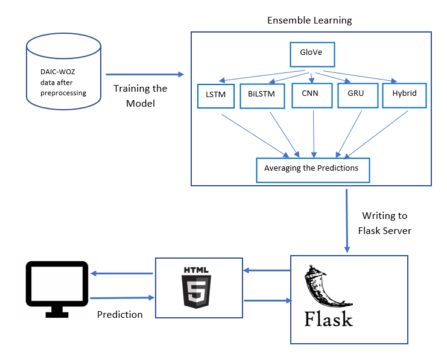
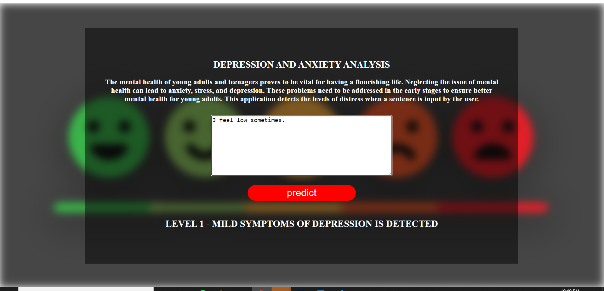
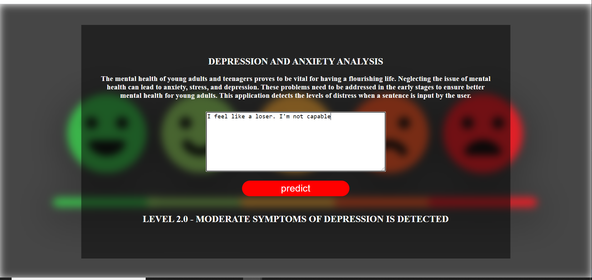

# Detecting Depression with a Flask Application

The mental health of young adults and teenagers proves to be vitalfor having a flourishing life.  Neglecting the issue of mental health can lead toanxiety, stress, and depression.  These problems need to be addressed in theearly stages to ensure better mental health for young adults.  This paper pro-vides a comprehensive study by leveraging natural language processing anddeep learning techniques to detect depression by examining the relationshipbetween language usage and the psychological characteristics of the commu-nicator.  A private dataset DAIC-WOZ has been used to predict the levelsof depression.  It includes audio, video, and textual information from 189 in-terviews.  This paper focuses on the textual analysis of detecting depressionfrom transcripts of the interviews conducted by an animated virtual inter-viewer.  Due to the disadvantages faced by the context independent nature ofGloVe embeddings, the proposed approach uses transfer learning techniquessuch as ELMo, ULMFit, and BERT for predicting depression severity fromtranscripts.  Furthermore, a Python Web application has been deployed toidentify negative sentiments and depression severity from sentences inputtedfrom  the  user.   The  proposed  approach  uses  an  ensemble  learning  methodfor the application to provide better predictions for classifying the texts intolevels of depression.  Hence, the inferences made in this paper can be extrap-olated to other all demographics around the world to help detect depressionin textual data as the algorithms and techniques used are all-encompassing.

## Model Achitecture
Flask is a web framework for the programming language python, whichmeans it offers features to create web applications, including handling HTTPrequests  and  creating  templates.  The  Python  Flask  framework  has  beendeployed to identify emotions and recognize the level of depression from auser  input  sentence.   According  to  Figure  11,  the  pre-processed  tokenizedwords are converted to word embeddings using the pretrained GloVe wordembeddings.  The word embeddings are trained with each model to producepredictions which is then followed by ensemble averaging method to producebetter predictions.  The ensemble predictions are then written into the Flaskserver and the predictions are outputted based on the user’s input.

## Flask Application Screenshots
### Level-1 Mild Symptoms

### Level-2 Moderate Symptoms

